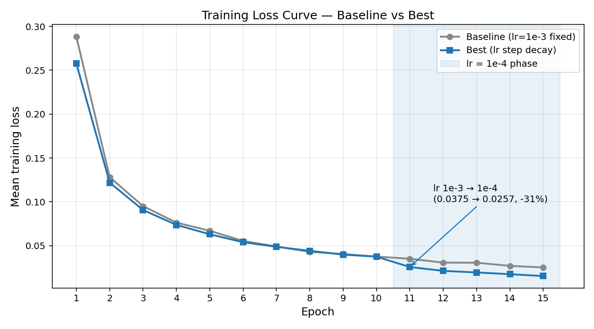
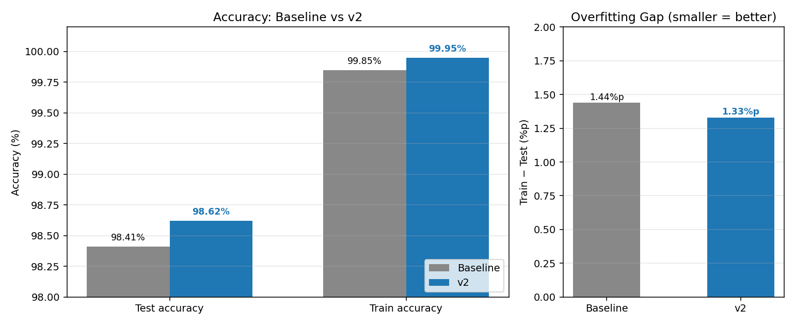
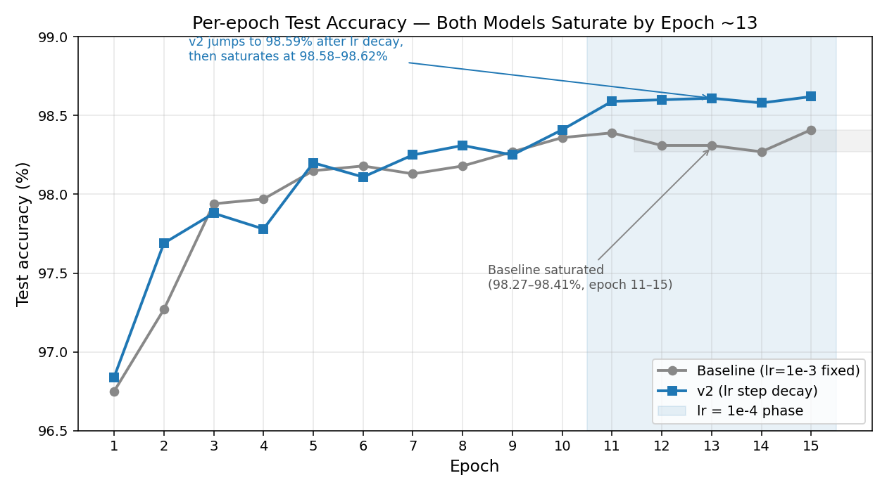

# MNIST 손글씨 인식 — NumPy 신경망

---

## MNIST 손글씨 인식 과제

### NumPy만으로 구현한 신경망 — Baseline → 회고 → 개선 모델 (v2)

| 반 | 팀 | 팀원 |
| -- | -- | --- |
| SW-AI | 1조 | 박지용 · 김석제 · 서원규 · 김진호 |

Baseline 모델로 **Test 98.41%**를 먼저 달성한 뒤, 회고에서 발견한 **2가지 문제를 직접 해결하고 1가지 설계 페어링을 더한 개선 모델 (v2)**로 **Test 98.62%** 도달

---

## 1. 과제 & 목표

**무엇을 하는가**
- MNIST 10-class 분류를 PyTorch / TensorFlow 없이 **NumPy만으로**
- Forward → Loss → Backward → Optimizer Update **전 사이클 직접 구현**

**목표**
- Test accuracy **≥ 95%** (권장 **≥ 97%**)
- 참고: 『밑바닥부터 시작하는 딥러닝』 1–6장

**검증 기준**
- 학습 정확도 + **단위 테스트 21개** (각 layer / optimizer forward·backward) 전부 통과

---

## 2. Baseline — 먼저 만든 모델과 그 한계

**Baseline 구성**
- 은닉층 폭 512 / 256 · Dropout 0.3 · learning rate 1e-3 **고정** · 15 epoch · Adam · He 초기화
- 총 파라미터 537,354개, 학습 시간 약 4분

**Baseline 결과 — 목표는 통과, 하지만…**
- **Test 98.41% / Train 99.85%** — 권장 목표 97%를 통과
- 그러나 **두 가지 개선 포인트**가 회고에서 눈에 띔

| 신호 | 무엇을 보았나 | 어떤 문제로 해석했나 |
| -- | -- | -- |
| **① 후반 loss saturation** | epoch 13→14→15 loss: 0.0306 → 0.0270 → 0.0252. 더 이상 의미 있게 안 떨어짐 | **lr이 후반에는 너무 커서 minimum 주변을 진동** — fine-tuning이 안 됨 |
| **② Train/Test 1.44%p 격차** | Train 99.85% vs Test 98.41% | **경미한 과적합** — train이 거의 100%까지 올라온 만큼 일반화 여력을 더 짤 수 있음 |

> **참고.** Train 99.85% 자체는 정상치 — "문제 신호"가 아님.
> 다만 §3의 ② 처방(Dropout 강화)이 effective capacity를 깎는 부작용이 있어, 보완용 **설계 페어링**으로 모델 폭을 함께 키웁니다.

---

## 3. 개선 방향 — 2가지 해결 방법 + 1가지 설계 페어링

§2의 두 신호에 **1:1 해결 방법 2개**, 그중 **해결 방법 ②의 부작용을 보완하는 설계 페어링 1개**를 묶었습니다.

### 한눈에 보기 — 신호 → 변경

| Baseline 신호 | 변경 | 종류 | 핵심 근거 |
| -- | -- | -- | -- |
| ① 후반 loss saturation | **lr step decay** 1e-3 → 1e-4 (epoch 10/11 경계) | 해결 방법 | lr 클 땐 진동, 작을 땐 fine-tuning → 후반에 줄여 fine-tuning 단계 분리 (표준 전략) |
| ② Train/Test 1.44%p 격차 | **Dropout 0.3 → 0.4** | 해결 방법 | 정규화 강도 ↑ → 일반화 ↑ (격차 축소 기대) |
| (— ②의 부작용 보완) | **은닉층 폭 2× (512/256 → 1024/512)** | **설계 페어링** | Dropout 강화로 줄어든 effective capacity 보상 |

### 설계 페어링이 왜 "페어링"인가 — 폭 2×의 의도

| 측면 | 내용 |
| -- | -- |
| **무엇이 아닌가** | "새 문제에 대한 해결 방법"이 아님 — 해결 방법 ②의 **동반 조정** |
| **왜** (주된 이유) | Dropout 0.3 → 0.4로 forward마다 살아남는 뉴런 비율 ↓ → **effective capacity 감소**. 이를 폭으로 보상 — "정규화 강화 + capacity 증가"는 표준 페어링 |
| **부수효과** | baseline의 train 99.85%가 진짜 capacity 상한인지 자연히 확인 (회고는 §8) |

### Xavier 초기화 비교는 왜 제외했나

| 비교 항목 | He 초기화 | Xavier 초기화 |
| -- | -- | -- |
| 분산 | **√(2/fan_in)** | √(1/fan_in) |
| 설계 의도 | ReLU의 "음수 절반 차단" 손실 보상 | sigmoid/tanh 등 대칭 활성화 |
| ReLU와의 적합도 | **정확히 맞음** | vanishing 가능성 ↑ (깊어질수록 신호 작아짐) |

→ 이론적으로 He 우위가 명백. "음성 결과 재확인 실험"보다 **위 2개 해결 방법 + 1 페어링의 효과 검증이 더 의미 있다고 판단**.

---

위 세 변경(해결 방법 2 + 페어링 1)을 한 번에 적용한 결과물을 **"개선 모델 (v2)"**라고 부릅니다.

---

## 4. 모델 구조 — Baseline vs v2

| 구분           | Baseline                                   | 개선 모델 (v2)                                       |
| ------------ | ------------------------------------------ | --------------------------------------------------- |
| 은닉층 1        | Affine **512** + BN + ReLU + Dropout **0.3** | Affine **1024** + BN + ReLU + Dropout **0.4**       |
| 은닉층 2        | Affine **256** + BN + ReLU + Dropout **0.3** | Affine **512**  + BN + ReLU + Dropout **0.4**       |
| 출력층          | Affine 10 + Softmax                        | Affine 10 + Softmax                                 |
| 초기화          | He                                         | He (동일)                                             |
| **총 파라미터 수** | **537,354**                                | **1,336,842** (≈ 2.5×)                              |

```
입력 784  (28×28 픽셀, 0–1 정규화)
   │
   ▼
[Affine] → BatchNorm → ReLU → Dropout    ← 은닉 블록 ×2 (폭과 dropout 비율이 두 모델 차이)
   │
   ▼
[Affine 10] → Softmax → 클래스 확률
```

은닉층 폭을 두 배로 키운 이유는 §3에서 설명한 **설계 페어링** — Dropout 강화로 줄어든 effective capacity 보상 (+ baseline capacity 한계 가설의 부수 확인)입니다.

---

## 5. 학습 설정 — Baseline vs v2

| 항목                     | Baseline                         | 개선 모델 (v2)                                       |
| ---------------------- | -------------------------------- | --------------------------------------------------- |
| 옵티마이저                  | Adam (β₁=0.9, β₂=0.999, ε=1e-8)  | Adam (동일)                                          |
| **learning rate (lr)** | **1e-3 고정**                      | **Step decay**: epoch 1–10 = 1e-3 → 11–15 = 1e-4    |
| Dropout 비율             | 0.3                              | 0.4                                                 |
| epochs                 | 15                               | 15                                                  |
| batch size             | 128                              | 128                                                 |
| 셔플                     | 매 epoch `np.random.permutation`  | 동일                                                  |
| seed                   | 42                               | 42                                                  |

**미니배치마다 반복하는 4단계** (둘 다 동일)

1. **Forward** — `model.forward(x_batch, train=True)`
2. **Loss** — `cross_entropy_loss(y_pred, y_batch)`
3. **Backward** — Softmax+CE 결합 gradient `(y_pred − y_one_hot) / N`
4. **Update** — `optimizer.update(params, grads)` (in-place)

---

## 6. 학습 손실 — 해결 방법 ①의 효과가 가장 또렷



- 두 모델 모두 **단조 감소**, 진동·재상승 없음
- **epoch 10 → 11**에서 v2의 lr이 1e-3 → 1e-4로 전환되며 loss **0.0375 → 0.0257 (-31%)** 한 번 더 큰 폭 감소 → **해결 방법 ①(lr step decay)가 saturation을 풀어냈다는 직접 증거**
- 마지막 epoch loss: Baseline **0.0252** vs v2 **0.0154**

---

## 7. 최종 정확도 — 세 변경의 종합 효과



| 지표              | Baseline   | 개선 모델 (v2) | 변화           |
| --------------- | ---------- | ------------ | ------------ |
| **Test accuracy** | 98.41%   | **98.62%**   | **+0.21%p**  |
| Train accuracy  | 99.85%     | 99.95%       | +0.10%p      |
| Train/Test 격차   | 1.44%p     | 1.33%p       | -0.11%p      |
| 총 파라미터 수        | 537,354    | 1,336,842    | ≈ 2.5×       |
| 학습 시간           | 234초 (≈ 4분) | 1371초 (≈ 23분) | ≈ 6×        |
| 단위 테스트          | 21개 전부 통과 | 21개 전부 통과   | —            |

두 모델 모두 권장 목표 97% 초과 달성, v2는 **+1.62%p 초과 달성**.

환경: Python 3.11.15 · NumPy 2.4.6 · Matplotlib 3.10.9 · pytest 9.0.3 · Windows 11 (로컬 CPU)

---

## 8. 해결 방법·페어링 회고 — 의도대로 작동했나

세 변경(해결 방법 2 + 페어링 1)을 동시에 적용한 단일 실험이라 효과 분리(ablation)는 한계지만, 관찰 신호로부터 다음을 추정합니다.

**해결 방법 ① lr step decay — 의도대로, 효과 가장 또렷 (사실상 단독 기여로 확인)**
- 의도: 후반 saturation 해소
- 관찰: epoch 10→11에서 loss -31% 추가 감소. test 정확도도 98.41% → 98.59%로 +0.18%p 점프 (부록 E)
- **부록 E의 결정적 증거**: v2 phase 1(lr=1e-3, 10 epoch) 종료 시점 정확도가 98.41%로 baseline 최종(98.41%)과 정확히 같음 → **v2의 +0.21%p 향상은 거의 전부 lr decay 단계에서 발생**
- 결론: **세 변경 중 가장 큰 단일 기여 — "추정"이 아니라 데이터로 입증됨**

**해결 방법 ② Dropout 0.3 → 0.4 — 의도대로, 효과는 작지만 방향 일치**
- 의도: 1.44%p 격차 축소
- 관찰: 격차 1.44%p → 1.33%p (-0.11%p)
- 결론: **방향은 맞지만 폭은 작음.** 더 큰 폭(0.5)이나 다른 정규화(데이터 증강)와 조합 필요할 수 있음

**페어링: 은닉층 폭 2배 — 해결 방법 ②의 동반자 역할로 정확히 작동**
- 의도: Dropout 강화로 줄어든 effective capacity 보상 (주된 의도) + capacity 한계 가설 부수 확인
- 관찰: train 99.85% → 99.95% (+0.10%p). 더 큰 모델이 더 높은 train accuracy를 달성 → **baseline의 99.85%가 진정한 capacity 한계는 아니었음**(부수효과로 확인)
- 결론: **단독 효과는 작지만 의도가 "단독 효과"가 아님**. Dropout 0.4 강화에 짝으로 묶여야 의미 있는 동반 조정 — 정확히 그 역할을 함

---

## 9. 구현하며 배운 핵심

**in-place 갱신 (`-=`)**
`=` 재할당하면 dict만 바뀌고 layer는 옛 배열을 계속 봐서 학습이 안 됨

**train / test 모드 분리**
BatchNorm은 배치 통계 ↔ running 통계, Dropout은 mask ↔ scale — 잘못 쓰면 정확도 폭락

**Softmax + Cross Entropy 결합 미분**
둘을 합쳐 미분하면 `(y_pred − y_true) / N`으로 깔끔하게 정리

**Shape 매칭이 backward 디버깅 1차 관문**
`dW.shape == W.shape`, `db.shape == b.shape`, `dγ.shape == γ.shape`

---

## 10. 한계 & 향후 과제

**현재 한계**
- **세 변경(해결 방법 2 + 페어링 1)을 동시에 적용해 효과 분리가 어렵다** — 부록 E에서 v2 phase 1 = baseline 최종 정확도로 lr decay의 기여를 큰 폭 분리해냈지만, 폭 2배 단독·Dropout 0.4 단독 효과까진 ablation 필요
- 학습 시간 trade-off: +0.21%p 정확도를 위해 학습 시간 **약 6배** (4분 → 23분)
- 두 모델 모두 epoch 15에서 test 정확도가 saturate된 상태 (부록 E) → 단순 epoch 증가로는 추가 향상 어려움
- CNN 없이 MLP로는 약 98.6%대가 사실상 상한

**다음에 해 볼 것**
- **Ablation 실험**: 세 변경을 1개씩만 적용한 3개 모델을 만들어 단독 효과 정량화
  - 특히 검증할 가설: **"B+LD"(baseline 구조 + lr decay + Dropout 0.4, **width 페어링 제외**)가 v2의 정확도를 학습 시간 약 1/6로 대체 가능한지** — 부록 E에서 lr decay가 사실상 단독 기여로 보이는 만큼 가설의 신빙성 ↑
- Xavier vs He 정량 비교 (이론적 결론과 실측 일치 확인)
- Dropout 0.5 + 더 깊은 네트워크 (3–4 은닉층)
- Data augmentation (작은 회전 / 시프트로 train/test gap 축소)
- Cosine annealing 등 부드러운 lr 스케줄링과 step decay 비교
- Train/val split을 따로 두고 per-epoch val 모니터링으로 **early stopping** 적용 (현재는 train에서 직접 test acc를 측정 중)

---

## 부록 A · 코드 구조 & 재현 방법

```
src/
├── activations.py     # ReLU, Softmax
├── layers.py          # Affine, BatchNorm, Dropout
├── losses.py          # cross_entropy_loss
├── optimizers.py      # SGD, Adam
├── network.py         # NeuralNetwork (조립, hidden_sizes/init 인자)
├── training.py        # train, evaluate, plot_loss_history
└── data.py            # load_mnist (제공됨)

scripts/
├── run_mnist.py       # Baseline 구성 학습 (≈ 4분, Test 98.41%)
├── run_experiment.py  # 개선 모델 (v2) 학습 (≈ 23분, Test 98.62%)
└── make_plots.py      # 발표용 PNG 생성

figures/
├── loss_curve.png
└── baseline_vs_v2.png
```

```bash
conda create -n mnist-lab python=3.11 -y
conda activate mnist-lab
pip install -r requirements.txt
python download_mnist.py            # 데이터 다운로드 (최초 1회)
pytest tests/ -v                    # 단위 테스트 21개
python scripts/run_mnist.py         # Baseline 학습 + 평가
python scripts/run_experiment.py    # v2 학습 + 평가
python scripts/make_plots.py        # 발표 그림 재생성
```

---

## 부록 B · 손실 커브 원자료

| Epoch | Baseline | v2 (lr)       | Epoch | Baseline | v2 (lr)       | Epoch | Baseline | v2 (lr)       |
| ----- | -------- | ------------- | ----- | -------- | ------------- | ----- | -------- | ------------- |
| 1     | 0.2884   | 0.2577 (1e-3) | 6     | 0.0554   | 0.0540 (1e-3) | 11    | 0.0351   | 0.0257 (1e-4) |
| 2     | 0.1281   | 0.1219 (1e-3) | 7     | 0.0491   | 0.0487 (1e-3) | 12    | 0.0307   | 0.0213 (1e-4) |
| 3     | 0.0951   | 0.0907 (1e-3) | 8     | 0.0430   | 0.0442 (1e-3) | 13    | 0.0306   | 0.0195 (1e-4) |
| 4     | 0.0763   | 0.0737 (1e-3) | 9     | 0.0405   | 0.0398 (1e-3) | 14    | 0.0270   | 0.0175 (1e-4) |
| 5     | 0.0670   | 0.0630 (1e-3) | 10    | 0.0376   | 0.0375 (1e-3) | 15    | 0.0252   | 0.0154 (1e-4) |

---

## 부록 C · 단위 테스트 결과

```
tests/test_relu.py ...                          [ 14%]
tests/test_softmax.py ...                       [ 28%]
tests/test_affine.py ..                         [ 38%]
tests/test_cross_entropy_loss.py ..             [ 47%]
tests/test_sgd.py .                             [ 52%]
tests/test_adam.py .                            [ 57%]
tests/test_neural_network.py ...                [ 71%]
tests/test_batchnorm.py ..                      [ 80%]
tests/test_dropout.py ..                        [ 90%]
tests/test_evaluate.py .                        [ 95%]
tests/test_training.py .                        [100%]

============================ 21 passed in 0.60s ===============================
```

---

## 부록 D · 파라미터 분포 (개선 모델 v2)

| Layer       | 파라미터                  | 개수            |
| ----------- | --------------------- | ------------- |
| Affine 1    | W(784×1024) + b(1024) | 803,840       |
| BatchNorm 1 | γ(1024) + β(1024)     | 2,048         |
| Affine 2    | W(1024×512) + b(512)  | 524,800       |
| BatchNorm 2 | γ(512) + β(512)       | 1,024         |
| Affine 3    | W(512×10) + b(10)     | 5,130         |
| **합계**      |                       | **1,336,842** |

---

## 부록 E · Per-epoch Test Accuracy 곡선 — Saturation 검증

"epoch을 더 늘리면 더 좋아지지 않냐?"라는 질문에 데이터로 답하기 위해, **매 epoch이 끝날 때마다 test set 정확도를 측정**해 곡선을 만들었습니다.

**구현 메모.** 원래 `train()`은 epoch별 **loss**만 기록해 반환했습니다 (test_training.py가 검증하는 계약). 부록 E의 정확도 곡선을 그리려면 동일한 epoch 단위 x축에 **test accuracy**라는 y축을 하나 더 붙여야 했고, 이를 위해 `train()`에 `eval_data=(x_test, y_test)` 옵션을 추가했습니다. 인자가 주어지면 매 epoch 끝에 `model.predict()`로 추론 모드 정확도를 한 번 더 측정해 `eval_acc_history`로 함께 반환하고, 인자가 없으면 기존처럼 `loss_history`만 반환해 기존 호출자/테스트와의 호환을 유지합니다.



### Epoch별 원자료

| Epoch | Baseline | v2 | Epoch | Baseline | v2 |
| ----- | -------- | --------- | ----- | -------- | -------- |
| 1 | 96.75% | 96.84% | 9 | 98.27% | 98.25% |
| 2 | 97.27% | 97.69% | 10 | 98.36% | 98.41% (phase 1 끝) |
| 3 | 97.94% | 97.88% | 11 | 98.39% | **98.59%** (lr decay 직후) |
| 4 | 97.97% | 97.78% | 12 | 98.31% | 98.60% |
| 5 | 98.15% | 98.20% | 13 | 98.31% | 98.61% |
| 6 | 98.18% | 98.11% | 14 | 98.27% | 98.58% |
| 7 | 98.13% | 98.25% | 15 | 98.41% | 98.62% |
| 8 | 98.18% | 98.31% | | | |

### 핵심 관찰 — "epoch 더 늘리면?" 질문에 대한 데이터 기반 답

**① Baseline은 epoch 11 이후 명백한 saturation**
- epoch 11–15에서 98.27%~98.41% 사이를 진동만 함
- epoch 11에서 98.39%로 사실상 peak에 도달, 이후 4 epoch을 더 돌려도 의미 있는 상승 없음

**② v2도 lr decay 후 곧 saturation**
- epoch 10→11에서 98.41%→**98.59%로 +0.18%p 점프** (lr 1e-3→1e-4 직후)
- 그 이후 98.58%~98.62% 사이에서만 미세 진동 — 사실상 평탄

**③ 가장 흥미로운 발견 — v2의 향상은 거의 전부 lr decay 단계에서**
- v2 phase 1(lr=1e-3, 10 epoch) 최종 정확도 **98.41%** = baseline 15 epoch 최종 **98.41%**
- 즉 "넓은 폭 + Dropout 0.4 + 10 epoch"은 "원래 폭 + Dropout 0.3 + 15 epoch"과 **같은 정확도에 빠르게 도달**할 뿐, lr=1e-3만으론 baseline 천장을 못 넘음
- **+0.21%p 향상은 사실상 해결 방법 ①(lr step decay)이 단독으로 만들어낸 결과로 보임** — §8 회고의 추정을 데이터가 강하게 뒷받침

### 결론

- 두 모델 모두 epoch 15 시점에서 **test 정확도가 saturate된 상태** → 단순 epoch 증가는 비용만 늘고 효과 거의 없음
- 추가 정확도를 짜내려면 epoch보다 **구조적 변화**(CNN 도입, data augmentation 등)나 더 큰 lr decay 깊이가 필요해 보임
